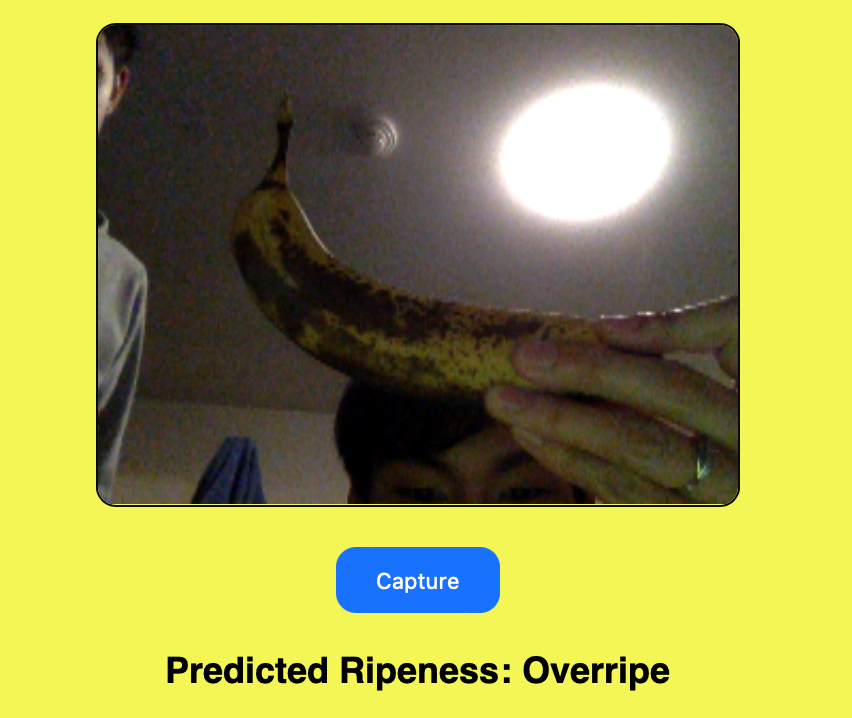

# Banana Ripeness Classification

## Project Overview

This project classifies the ripeness of a banana based on an image. Bananas are classified as unripe, ripe, overripe, rotten

Relevant Technologies: Tensorflow, Flask, sci-kit-image

## Installation 

Clone the repository
``` 
git clone https://github.com/RonaldLinDev/bananaRipeness
```
Install dependencies 
```
pip install -r requirements.txt
```
Run the Server Locally
```
flask run
```

## Usage 

The web application will ask for access to the user's webcam. Centering an image of a banana on the webcam and clicking 'Capture' will cause the model to output its predicted ripeness classification.


(Image Classification API is currently down due to server costs)
Hosted here: https://bananaripeness.onrender.com 

## Example

